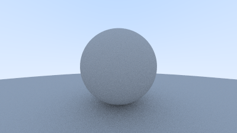

# 使用Rust实现RayTracingInOneWeekend

## 初始化

使用`cargo`创建工程

    cargo new --name in_one_weekend InOneWeekend

## 输出图像

### PPM图像格式

修改main.rs为：

```rust
fn main() {
    // Image
    let image_width = 256;
    let image_height = 256;

    // Render
    println!("P3\n{} {}\n255", image_width, image_height);

    for j in 0..image_height {
        for i in 0..image_width {
            let r = i as f64 / (image_width - 1) as f64;
            let g = j as f64 / (image_height - 1) as f64;
            let b = 0.0;

            let ir = (255.999 * r) as i32;
            let ig = (255.999 * g) as i32;
            let ib = (255.999 * b) as i32;

            println!("{} {} {}", ir, ig, ib);
        }
    }
}
```
[main.rs]创建你的第一张图像

### 创建图像文件

构建：

    cargo build

运行：

    target/debug/in_one_weekend > image.ppm

构建Release：

    cargo build --release

运行Release：

    target/release/in_one_weekend > image.ppm


### 添加进度指示器

```rust
fn main() {
    // Image
    let image_width = 256;
    let image_height = 256;

    // Render
    println!("P3\n{} {}\n255", image_width, image_height);

    for j in 0..image_height {
+       eprintln!("\rScanlines remaining: {}", image_height - j);
        for i in 0..image_width {
            let r = i as f64 / (image_width - 1) as f64;
            let g = j as f64 / (image_height - 1) as f64;
            let b = 0.0;

            let ir = (255.999 * r) as i32;
            let ig = (255.999 * g) as i32;
            let ib = (255.999 * b) as i32;

            println!("{} {} {}", ir, ig, ib);
        }
    }
+
+   eprintln!("\nDone.");
}
```
_[main.rs] 主渲染循环与进度报告_

## vec3类

```rust
use std::ops::{
    AddAssign,
    DivAssign,
    Index,
    IndexMut,
    MulAssign,
    Neg,
};

#[derive(Clone, Copy, Debug)]
pub struct Vec3 {
    pub e: [f64; 3]
}

impl Default for Vec3 {
    fn default() -> Self {
        Self { e: [0.0, 0.0, 0.0] }
    }
}

impl Neg for Vec3 {
    type Output = Self;

    fn neg(self) -> Self::Output {
        Vec3 { e: [-self.e[0], -self.e[1], -self.e[2]] }
    }
}

impl Index<usize> for Vec3 {
    type Output = f64;

    fn index(&self, i: usize) -> &Self::Output {
        &self.e[i]
    }
}

impl IndexMut<usize> for Vec3 {
    fn index_mut(&mut self, i: usize) -> &mut Self::Output {
        &mut self.e[i]
    }
}

impl AddAssign for Vec3 {
    fn add_assign(&mut self, other: Self) {
        self.e[0] += other.e[0];
        self.e[1] += other.e[1];
        self.e[2] += other.e[2];
    }
}

impl MulAssign<f64> for Vec3 {
    fn mul_assign(&mut self, t: f64) {
        self.e[0] *= t;
        self.e[1] *= t;
        self.e[2] *= t;
    }
}

impl DivAssign<f64> for Vec3 {
    fn div_assign(&mut self, t: f64) {
        *self *= 1.0 / t;
    }
}

impl Add for Vec3 {
    type Output = Self;

    fn add(self, other: Self) -> Self::Output {
        Vec3 { e: [self.e[0] + other.e[0], self.e[1] + other.e[1], self.e[2] + other.e[2]] }
    }
}

impl Sub for Vec3 {
    type Output = Self;

    fn sub(self, other: Self) -> Self::Output {
        Vec3 { e: [self.e[0] - other.e[0], self.e[1] - other.e[1], self.e[2] - other.e[2]] }
    }
}

impl Mul for Vec3 {
    type Output = Self;

    fn mul(self, other: Self) -> Self::Output {
        Vec3 { e: [self.e[0] * other.e[0], self.e[1] * other.e[1], self.e[2] * other.e[2]] }
    }
}

impl Mul<f64> for Vec3 {
    type Output = Self;

    fn mul(self, t: f64) -> Self::Output {
        Vec3 { e: [self.e[0] * t, self.e[1] * t, self.e[2] * t] }
    }
}

impl Mul<Vec3> for f64 {
    type Output = Vec3;

    fn mul(self, v: Vec3) -> Self::Output {
        v * self
    }
}

impl Div<f64> for Vec3 {
    type Output = Self;

    fn div(self, t: f64) -> Self::Output {
        (1 as f64 / t) * self
    }
}

impl std::fmt::Display for Vec3 {
    fn fmt(&self, f: &mut std::fmt::Formatter) -> std::fmt::Result {
        write!(f, "{} {} {}", self.e[0], self.e[1], self.e[2])
    }
}

impl Vec3 {
    pub fn new(e0: f64, e1: f64, e2: f64) -> Self {
        Self { e: [e0, e1, e2] }
    }

    pub fn x(&self) -> f64 { self.e[0] }
    pub fn y(&self) -> f64 { self.e[1] }
    pub fn z(&self) -> f64 { self.e[2] }

    pub fn length(&self) -> f64 {
        (self.e[0] * self.e[0] + self.e[1] * self.e[1] + self.e[2] * self.e[2]).sqrt()
    }

    pub fn squared_length(&self) -> f64 {
        self.e[0] * self.e[0] + self.e[1] * self.e[1] + self.e[2] * self.e[2]
    }
}

pub type Point3 = Vec3;

pub fn dot(u: &Vec3, v: &Vec3) -> f64 {
    u.e[0] * v.e[0] + u.e[1] * v.e[1] + u.e[2] * v.e[2]
}

pub fn cross(u: &Vec3, v: &Vec3) -> Vec3 {
    Vec3 { e: [
        u.e[1] * v.e[2] - u.e[2] * v.e[1],
        u.e[2] * v.e[0] - u.e[0] * v.e[2],
        u.e[0] * v.e[1] - u.e[1] * v.e[0],
    ]}
}

pub fn unit_vector(v: &Vec3) -> Vec3 {
    (*v).clone() / v.length()
}
```
_[vec3.rs]Vec3 定义和辅助函数_

需要注意的是和C++不同Rust不能重载运算符，需要通过实现不同运算符的Trait来实现相关功能。另外这里通过实现std::fmt::Display这个Trait来达到C++中ostream输出的功能。还有由于Rust的所有权特性，这里为Vec3实现了Copy Trait，这样更接近C++中vec3的行为。

### 颜色实用函数

```rust
use std::io::Write;

use super::vec3::Vec3;

pub type Color = Vec3;

impl Color {
    pub fn write_color(&self, out: &mut dyn Write) -> std::io::Result<()> {
        write!(out, "{} {} {}\n",
        (255.999 * self.x()) as i32,
        (255.999 * self.y()) as i32,
        (255.999 * self.z()) as i32)
    }
}
```
_[color.rs]Color 实用函数_

然后修改main.rs：

```rust
+pub mod vec3;
+pub mod color;

fn main() {
    // Image
    let image_width = 256;
    let image_height = 256;

    // Render
    println!("P3\n{} {}\n255", image_width, image_height);
+   let stdout = std::io::stdout();

    for j in 0..image_height {
        eprintln!("\rScanlines remaining: {}", image_height - j);
        for i in 0..image_width {
+           let pixel_color = color::Color::new(
+               i as f64 / (image_width - 1) as f64,
+               j as f64 / (image_height - 1) as f64,
+               0.0);
+           pixel_color.write_color(&mut stdout.lock()).unwrap();
        }
    }

    eprintln!("\nDone.");
}
```
_[main.rs] 第一个PPM图像的最终代码_

## 光线、简单相机和背景

### 光线类

```rust
use super::vec3::{
    Vec3,
    Point3,
};

pub struct Ray {
    orig: Vec3,
    dir: Vec3,
}

impl Default for Ray {
    fn default() -> Self {
        Self {
        orig: Vec3::default(),
        dir: Vec3::default(),
        }
    }
}

impl Ray {
    pub fn new(orig: &Point3, dir: &Vec3) -> Self {
        Self {
        orig: *orig,
        dir: *dir,
        }
    }

    pub fn origin(&self) -> &Point3 {
        &self.orig
    }

    pub fn direction(&self) -> &Vec3 {
        &self.dir
    }

    pub fn at(&self, t: f64) -> Point3 {
        self.orig + self.dir * t
    }
}
```
_[ray.rs] 光线类_

### 发送光线到场景中

```rust
let aspect_ratio = 16.0 / 9.0;
let image_width = 400;

// 计算图像高度，并确保至少为1。
let image_height = image_width / aspect_ratio as i32;
let image_height = if image_height < 1 { 1 } else { image_height };

// 视口宽度小于1是可以的，因为它们是实值。
let viewport_height = 2.0;
let viewport_width = viewport_height * (image_width as f64 / image_height as f64);
```
_渲染设置_

```rust
pub mod vec3;
+pub mod color;
pub mod ray;

use vec3::{
    Vec3,
    Point3,
};
use color::Color;
use ray::Ray;

+fn ray_color(r: &Ray) -> Color {
+   Color::new(0.0, 0.0, 0.0)
}

fn main() {
    // Image
+   let aspect_ratio = 16.0 / 9.0;
+   let image_width = 400;
+
+   // 计算图像高度，并确保至少为1。
+   let image_height = image_width / aspect_ratio as i32;
+   let image_height = if image_height < 1 { 1 } else { image_height };
+
+   // Camera
+   let focal_length = 1.0;
+   let viewport_height = 2.0;
+   let viewport_width = viewport_height * (image_width as f64 / image_height as f64);
+   let camera_center = Point3::default();
+
+   // 计算水平和垂直视口边缘上的向量。
+   let viewport_u = Vec3::new(viewport_width, 0.0, 0.0);
+   let viewport_v = Vec3::new(0.0, -viewport_height, 0.0);
+
+   // 计算从像素到像素的水平和垂直增量向量。
+   let pixel_delta_u = viewport_u / image_width as f64;
+   let pixel_delta_v = viewport_v / image_height as f64;
+
+   // 计算左上角像素的位置。
+   let viewport_upper_left = camera_center
+       - Vec3::new(0.0, 0.0, focal_length) - viewport_u / 2.0 - viewport_v / 2.0;
+   let pixel00_loc = viewport_upper_left + 0.5 * (pixel_delta_u + pixel_delta_v);

    // Render
    println!("P3\n{} {}\n255", image_width, image_height);
    let stdout = std::io::stdout();

    for j in 0..image_height {
        eprintln!("\rScanlines remaining: {}", image_height - j);
        for i in 0..image_width {
+           let pixel_center = pixel00_loc + i as f64 * pixel_delta_u + j as f64 * pixel_delta_v;
+           let ray_direction = pixel_center - camera_center;
+           let r = Ray::new(&camera_center, &ray_direction);
+
+           let pixel_color = ray_color(&r);
            pixel_color.write_color(&mut stdout.lock()).unwrap();
        }
    }

    eprintln!("\nDone.");
}
```
_[main.rs] 创建场景光线_

```rust
pub mod vec3;
pub mod color;
pub mod ray;

use vec3::{
    Vec3,
    Point3,
};
use color::Color;
use ray::Ray;

fn ray_color(r: &Ray) -> Color {
+   let unit_direction = vec3::unit_vector(r.direction());
+   let a = 0.5 * (unit_direction.y() + 1.0);
+   (1.0 - a) * Color::new(1.0, 1.0, 1.0) + a * Color::new(0.5, 0.7, 1.0)
}

...
```
_[main.rs] 渲染一个蓝白渐变_


## 添加一个球体

### 射线-球体相交

```rust
+fn hit_sphere(center: &Point3, radius: f64, r: &Ray) -> bool {
+   let oc = *center - *r.origin();
+   let a = vec3::dot(r.direction(), r.direction());
+   let b = -2.0 * vec3::dot(r.direction(), &oc);
+   let c = vec3::dot(&oc, &oc) - radius * radius;
+   let discriminant = b * b - 4.0 * a * c;
+   discriminant >= 0.0
+}

fn ray_color(r: &Ray) -> Color {
+   if hit_sphere(&Point3::new(0.0, 0.0, -1.0), 0.5, r) {
+       return Color::new(1.0, 0.0, 0.0);
+   }
+
    let unit_direction = vec3::unit_vector(r.direction());
    let a = 0.5 * (unit_direction.y() + 1.0);
    (1.0 - a) * Color::new(1.0, 1.0, 1.0) + a * Color::new(0.5, 0.7, 1.0)
}
```
_[main.rs] 渲染一个红球_


## 表面法线和多个物体

### 使用表面法线进行着色

```rust
+fn hit_sphere(center: &Point3, radius: f64, r: &Ray) -> f64 {
    let oc = *center - *r.origin();
    let a = vec3::dot(r.direction(), r.direction());
    let b = -2.0 * vec3::dot(r.direction(), &oc);
    let c = vec3::dot(&oc, &oc) - radius * radius;
    let discriminant = b * b - 4.0 * a * c;

+   if discriminant < 0.0 {
+       -1.0
+   } else {
+       (-b - discriminant.sqrt()) / (2.0 * a)
+   }
}

fn ray_color(r: &Ray) -> Color {
+   let t = hit_sphere(&Point3::new(0.0, 0.0, -1.0), 0.5, r);
+   if t > 0.0 {
+       let n = vec3::unit_vector(&(r.at(t) - Vec3::new(0.0, 0.0, -1.0)));
+       return 0.5 * Color::new(n.x() + 1.0, n.y() + 1.0, n.z() + 1.0);
+   }

    let unit_direction = vec3::unit_vector(r.direction());
    let a = 0.5 * (unit_direction.y() + 1.0);
    (1.0 - a) * Color::new(1.0, 1.0, 1.0) + a * Color::new(0.5, 0.7, 1.0)
}
```
_[main.rs] 在球体上渲染表面法线_


### 简化射线与球体相交代码

```rust
fn hit_sphere(center: &Point3, radius: f64, r: &Ray) -> f64 {
    let oc = *center - *r.origin();
    let a = vec3::dot(r.direction(), r.direction());
    let b = -2.0 * vec3::dot(r.direction(), &oc);
    let c = vec3::dot(&oc, &oc) - radius * radius;
    let discriminant = b * b - 4.0 * a * c;

    if discriminant < 0.0 {
        -1.0
    } else {
        (-b - discriminant.sqrt()) / (2.0 * a)
    }
}
```
_[main.rs] 射线与球体相交代码（之前）_

```rust
fn hit_sphere(center: &Point3, radius: f64, r: &Ray) -> f64 {
    let oc = *center - *r.origin();
+   let a = r.direction().length_squared();
+   let h = vec3::dot(r.direction(), &oc);
+   let c = oc.length_squared() - radius * radius;
+   let discriminant = h * h - a * c;

    if discriminant < 0.0 {
        -1.0
    } else {
+       (h - discriminant.sqrt()) / a
    }
}
```
_[main.rs] 射线与球体相交代码（之后）_

### 一个可命中物体的抽象类

```rust
use super::vec3::{self, Vec3, Point3};
use super::ray::Ray;

pub struct HitRecord {
    pub p: Point3,
    pub normal: Vec3,
    pub t: f64,
}

pub trait Hittable {
    fn hit(&self, r: &Ray, ray_tmin: f64, ray_tmax: f64, hit_record: &mut HitRecord) -> bool;
}
```
_[hittable.rs] 可命中类_

```rust
use super::vec3::{
  self,
  Point3,
};
use super::ray::Ray;
use super::hittable::{
  HitRecord,
  Hittable,
};

pub struct Sphere {
  center: Point3,
  radius: f64,
}

impl Sphere {
  pub fn new(center: &Point3, radius: f64) -> Self {
    Self {
      center: *center,
      radius,
    }
  }
}

impl Hittable for Sphere {
    fn hit(&self, r: &Ray, ray_tmin: f64, ray_tmax: f64, hit_record: &mut HitRecord) -> bool {
        let oc = self.center - *r.origin();
        let a = r.direction().length_squared();
        let h = vec3::dot(r.direction(), &oc);
        let c = oc.length_squared() - self.radius * self.radius;

        let discriminant = h * h - a * c;
        if discriminant < 0.0 {
            return false;
        }
        let sqrtd = discriminant.sqrt();

        // Find the nearest root that lies in the acceptable range.
        let mut root = (h - sqrtd) / a;
        if root <= ray_tmin || ray_tmax <= root {
            root = (h + sqrtd) / a;
            if root <= ray_tmin || ray_tmax <= root {
                return false;
            }
        }

        hit_record.t = root;
        hit_record.p = r.at(hit_record.t);
        hit_record.normal = (hit_record.p - self.center) / self.radius;

        true
    }
}
```
_[sphere.rs] 球体类_

### 正面和背面

```rust
pub struct HitRecord {
    pub p: Point3,
    pub normal: Vec3,
    pub t: f64,
+   pub front_face: bool,
}

+impl HitRecord {
+   pub fn set_face_normal(&mut self, r: &Ray, outward_normal: &Vec3) {
+       // Sets the hit record normal vector.
+       // NOTE: the parameter `outward_normal` is assumed to have unit length.
+
+       self.front_face = vec3::dot(r.direction(), outward_normal) < 0.0;
+       self.normal = if self.front_face {
+           *outward_normal
+       } else {
+           -*outward_normal
+       };
+   }
+}
```
_[hittable.rs] 向hit_record添加正面跟踪_

```rust
impl Hittable for Sphere {
    fn hit(&self, r: &Ray, ray_tmin: f64, ray_tmax: f64, hit_record: &mut HitRecord) -> bool {
        ...

        hit_record.t = root;
        hit_record.p = r.at(hit_record.t);
+       let outward_normal = (hit_record.p - self.center) / self.radius;
+       hit_record.set_face_normal(r, &outward_normal);

        true
    }
}
```
_[sphere.rs] 具有法线确定的球体类_

### 可击中对象列表

```rust
use std::rc::Rc;

use super::hittable::{
    HitRecord,
    Hittable,
};
use super::ray::Ray;

#[derive(Default)]
pub struct HittableList {
    pub objects: Vec<Rc<dyn Hittable>>,
}

impl HittableList {
    pub fn new(object: Rc<dyn Hittable>) -> Self {
        Self {
            objects: vec![object],
        }
    }

    pub fn clear(&mut self) {
        self.objects.clear();
    }

    pub fn add(&mut self, object: Rc<dyn Hittable>) {
        self.objects.push(object);
    }

    pub fn hit(&self, r: &Ray, ray_tmin: f64, ray_tmax: f64, rec: &mut HitRecord) -> bool {
        let mut temp_rec = HitRecord::default();
        let mut hit_anything = false;
        let mut closest_so_far = ray_tmax;

        for object in self.objects.iter() {
            if object.hit(r, ray_tmin, closest_so_far, &mut temp_rec) {
                hit_anything = true;
                closest_so_far = temp_rec.t;
                *rec = temp_rec.clone();
            }
        }

        hit_anything
    }
}
```
_[hittable_list.rs] hittable_list类_

### 常用常量和实用函数

```rust
pub const INFINITY: f64 = std::f64::INFINITY;
pub const PI: f64 = std::f64::consts::PI;

pub fn degrees_to_radians(degrees: f64) -> f64 {
  degrees * PI / 180.0
}
```
_[rtweekend.rs] rtweekend.h通用头文件_

```rust
pub mod vec3;
pub mod color;
pub mod ray;
+pub mod hittable;
+pub mod sphere;
+pub mod hittable_list;
+pub mod rtweekend;
+
+use std::rc::Rc;

use vec3::{
    Vec3,
    Point3,
};
use color::Color;
use ray::Ray;
+use sphere::Sphere;
+use hittable::{
+   HitRecord,
+   Hittable,
+};
+use hittable_list::HittableList;

-fn hit_sphere(center: &Point3, radius: f64, r: &Ray) -> bool {
-   ...
-}

+fn ray_color(r: &Ray, world: &dyn Hittable) -> Color {
+   let mut rec = HitRecord::default();
+   if world.hit(r, 0.0, rtweekend::INFINITY, &mut rec) {
+       return 0.5 * (rec.normal + Color::new(1.0, 1.0, 1.0));
+   }

    let unit_direction = vec3::unit_vector(r.direction());
    let a = 0.5 * (unit_direction.y() + 1.0);
    (1.0 - a) * Color::new(1.0, 1.0, 1.0) + a * Color::new(0.5, 0.7, 1.0)
}

fn main() {
    // Image
    let aspect_ratio = 16.0 / 9.0;
    let image_width = 400;

    // 计算图像高度，并确保至少为1。
    let image_height = (image_width as f64 / aspect_ratio) as i32;
    let image_height = if image_height < 1 { 1 } else { image_height };

+   // World
+   let mut world = HittableList::default();
+   world.add(Rc::new(Sphere::new(
+       &Point3::new(0.0, 0.0, -1.0),
+       0.5,
+   )));
+   world.add(Rc::new(Sphere::new(
+       &Point3::new(0.0, -100.5, -1.0),
+       100.0,
+   )));
+
    // Camera
    let focal_length = 1.0;
    let viewport_height = 2.0;
    let viewport_width = viewport_height * (image_width as f64 / image_height as f64);
    let camera_center = Point3::default();

    // 计算水平和垂直视口边缘上的向量。
    let viewport_u = Vec3::new(viewport_width, 0.0, 0.0);
    let viewport_v = Vec3::new(0.0, -viewport_height, 0.0);

    // 计算从像素到像素的水平和垂直增量向量。
    let pixel_delta_u = viewport_u / image_width as f64;
    let pixel_delta_v = viewport_v / image_height as f64;

    // 计算左上角像素的位置。
    let viewport_upper_left = camera_center
        - Vec3::new(0.0, 0.0, focal_length) - viewport_u / 2.0 - viewport_v / 2.0;
    let pixel00_loc = viewport_upper_left + 0.5 * (pixel_delta_u + pixel_delta_v);

    // Render
    println!("P3\n{} {}\n255", image_width, image_height);
    let stdout = std::io::stdout();

    for j in 0..image_height {
        eprintln!("\rScanlines remaining: {}", image_height - j);
        for i in 0..image_width {
            let pixel_center = pixel00_loc + i as f64 * pixel_delta_u + j as f64 * pixel_delta_v;
            let ray_direction = pixel_center - camera_center;
            let r = Ray::new(&camera_center, &ray_direction);

+           let pixel_color = ray_color(&r, &world);
            pixel_color.write_color(&mut stdout.lock()).unwrap();
        }
    }

    eprintln!("\nDone.");
}
```
_[main.rs] 带有hittables的新主函数_


### 一个区间类

```rust
use super::rtweekend;

#[derive(Default)]
pub struct Interval {
    pub min: f64,
    pub max: f64,
}

impl Interval {
    pub fn new(min: f64, max: f64) -> Self {
        Self { min, max }
    }

    pub fn size(&self) -> f64 {
        self.max - self.min
    }

    pub fn contains(&self, x: f64) -> bool {
        self.min <= x && x <= self.max
    }

    pub fn surrounds(&self, x: f64) -> bool {
        self.min < x && x < self.max
    }
}

pub const EMPTY: Interval = Interval {
    min: rtweekend::INFINITY,
    max: -rtweekend::INFINITY,
};
pub const UNIVERSE: Interval = Interval {
    min: -rtweekend::INFINITY,
    max: rtweekend::INFINITY,
};
```
_[interval.rs] 介绍新的区间类_

```rust
pub trait Hittable {
+   fn hit(&self, r: &Ray, ray_t: &Interval, hit_record: &mut HitRecord) -> bool;
}
```
_[hittable.rs] 使用区间的hittable::hit()_

```rust
impl Hittable for HittableList {
+   fn hit(&self, r: &Ray, ray_t: &Interval, rec: &mut HitRecord) -> bool {
        let mut temp_rec = HitRecord::default();
        let mut hit_anything = false;
+       let mut closest_so_far = ray_t.max;

        for object in self.objects.iter() {
+           if object.hit(r, &Interval::new(ray_t.min, closest_so_far), &mut temp_rec) {
                hit_anything = true;
                closest_so_far = temp_rec.t;
                *rec = temp_rec.clone();
            }
        }

        hit_anything
    }
}
```
_[hittable_list.rs] 使用区间的hittable_list::hit()_

```rust
impl Hittable for Sphere {
+   fn hit(&self, r: &Ray, ray_t: &Interval, hit_record: &mut HitRecord) -> bool {
        ...

        // Find the nearest root that lies in the acceptable range.
        let mut root = (h - sqrtd) / a;
+       if !ray_t.surrounds(root) {
            root = (h + sqrtd) / a;
+           if !ray_t.surrounds(root) {
                return false;
            }
        }
        ...
    }
}
```
_[sphere.rs] 使用区间的球体_

```rust
fn ray_color(r: &Ray, world: &dyn Hittable) -> Color {
    let mut rec = HitRecord::default();
+   if world.hit(r, &Interval::new(0.0, rtweekend::INFINITY), &mut rec) {
        return 0.5 * (rec.normal + Color::new(1.0, 1.0, 1.0));
    }

    let unit_direction = vec3::unit_vector(r.direction());
    let a = 0.5 * (unit_direction.y() + 1.0);
    (1.0 - a) * Color::new(1.0, 1.0, 1.0) + a * Color::new(0.5, 0.7, 1.0)
}
```
_[main.rs] 使用区间的新主函数_

## 将相机代码移入自己的类中

```rust
use super::color::Color;
use super::hittable::Hittable;
use super::ray::Ray;

pub struct Camera {
}

impl Camera {
    pub fn render(&self, world: &dyn Hittable) {
        ...
    }

    fn initialize(&self) {
        ...
    }

    fn ray_color(&self, r: &Ray, world: &dyn Hittable) -> Color {
        ...
    }
}
```
_[camera.rs] 相机类框架_

```rust
impl Camera {
+   fn ray_color(r: &Ray, world: &dyn Hittable) -> Color {
+       let mut rec = HitRecord::default();
+       if world.hit(r, &Interval::new(0.0, rtweekend::INFINITY), &mut rec) {
+           return 0.5 * (rec.normal + Color::new(1.0, 1.0, 1.0));
+       }
+
+       let unit_direction = vec3::unit_vector(r.direction());
+       let a = 0.5 * (unit_direction.y() + 1.0);
+       (1.0 - a) * Color::new(1.0, 1.0, 1.0) + a * Color::new(0.5, 0.7, 1.0)
+   }
}
```
_[camera.rs] 相机的ray_color函数_

```rust
pub struct Camera {
    pub aspect_ratio: f64,  // Ratio of image width over height
    pub image_width: i32,   // Rendered image width in pixel count
    image_height: i32,      // Rendered image height
    center: Point3,         // Camera center
    pixel00_loc: Point3,    // Location of pixel 0, 0
    pixel_delta_u: Vec3,    // Offset to pixel to the right
    pixel_delta_v: Vec3,    // Offset to pixel below
}

impl Default for Camera {
    fn default() -> Self {
        Self {
            aspect_ratio: 1.0,
            image_width: 100,
            image_height: 0,
            center: Point3::default(),
            pixel00_loc: Point3::default(),
            pixel_delta_u: Vec3::default(),
            pixel_delta_v: Vec3::default(),
        }
    }
}

impl Camera {
    pub fn render(&mut self, world: &dyn Hittable) {
        self.initialize();

        println!("P3\n{} {}\n255", self.image_width, self.image_height);
        let stdout = std::io::stdout();

        for j in 0..self.image_height {
            eprintln!("\rScanlines remaining: {}", self.image_height - j);
            for i in 0..self.image_width {
                let pixel_center = self.pixel00_loc + i as f64 * self.pixel_delta_u + j as f64 * self.pixel_delta_v;
                let ray_direction = pixel_center - self.center;
                let r = Ray::new(&self.center, &ray_direction);

                let pixel_color = Self::ray_color(&r, world);
                pixel_color.write_color(&mut stdout.lock()).unwrap();
            }
        }

        eprintln!("\nDone.");
    }

    fn initialize(&mut self) {
        self.image_height = (self.image_width as f64 / self.aspect_ratio) as i32;
        self.image_height = if self.image_height < 1 { 1 } else { self.image_height };

        self.center = Point3::default();

        // 确认视口的大小。
        let focal_length = 1.0;
        let viewport_height = 2.0;
        let viewport_width = viewport_height * (self.image_width as f64 / self.image_height as f64);

        // 计算水平和垂直视口边缘上的向量。
        let viewport_u = Vec3::new(viewport_width, 0.0, 0.0);
        let viewport_v = Vec3::new(0.0, -viewport_height, 0.0);

        // 计算从像素到像素的水平和垂直增量向量。
        self.pixel_delta_u = viewport_u / self.image_width as f64;
        self.pixel_delta_v = viewport_v / self.image_height as f64;

        // 计算左上角像素的位置。
        let viewport_upper_left = self.center
            - Vec3::new(0.0, 0.0, focal_length) - viewport_u / 2.0 - viewport_v / 2.0;
        self.pixel00_loc = viewport_upper_left + 0.5 * (self.pixel_delta_u + self.pixel_delta_v);
    }
}
```
_[camera.rs] 工作的相机类_

```rust
pub mod vec3;
pub mod color;
pub mod ray;
pub mod hittable;
pub mod sphere;
pub mod hittable_list;
pub mod rtweekend;
pub mod interval;
pub mod camera;

use std::rc::Rc;

use vec3::Point3;
use sphere::Sphere;
use hittable_list::HittableList;
use camera::Camera;

fn main() {
    // World
    let mut world = HittableList::default();
    world.add(Rc::new(Sphere::new(
        &Point3::new(0.0, 0.0, -1.0),
        0.5,
    )));
    world.add(Rc::new(Sphere::new(
        &Point3::new(0.0, -100.5, -1.0),
        100.0,
    )));

    // Camera
    let mut cam = Camera::default();
    cam.aspect_ratio = 16.0 / 9.0;
    cam.image_width = 400;

    // Render
    cam.render(&world);
}
```
[main.rs] 使用新相机的新主程序

## 抗锯齿

### 一些随机数工具

```rust
// Utility Functions

pub fn degrees_to_radians(degrees: f64) -> f64 {
    degrees * PI / 180.0
}

+pub fn random_double() -> f64 {
+   // Returns a random real in [0,1).
+   rand::random::<f64>()
+}
+
+pub fn random_double_range(min: f64, max: f64) -> f64 {
+   // Returns a random real in [min,max).
+   min + (max - min) * random_double()
+}
```
_[rtweekend.rs] random_double()函数_

与C++不同，这里需要导入Rust的rand包，修改Cargo.toml文件。
```toml
[dependencies]
rand = "0"
```

### 使用多个采样生成像素

```rust
impl Interval {
    ...

    pub fn surrounds(&self, x: f64) -> bool {
        self.min < x && x < self.max
    }

+   pub fn clamp(&self, x: f64) -> f64 {
+       if x < self.min {
+           self.min
+       } else if x > self.max {
+           self.max
+       } else {
+           x
+       }
+   }
}
```
_[interval.rs] interval::clamp()辅助函数_

```rust
+use super::interval::Interval;

pub type Color = Vec3;

+const INTENSITY: Interval = Interval{ min: 0.0, max: 0.999 };

impl Color {
+   pub fn write_color(&self, out: &mut dyn Write, samples_per_pixel: usize) -> std::io::Result<()> {
+       let r = self.x();
+       let g = self.y();
+       let b = self.z();
+
+       // Divide the color by the number of samples.
+       let scale = 1.0 / samples_per_pixel as f64;
+       let r = scale * r;
+       let g = scale * g;
+       let b = scale * b;
+
+       // Write the translated [0,255] value of each color component.
+       writeln!(out, "{} {} {}",
+           (256.0 * INTENSITY.clamp(r)) as i32,
+           (256.0 * INTENSITY.clamp(g)) as i32,
+           (256.0 * INTENSITY.clamp(b)) as i32)
+   }
}
```
_[color.rs] 多采样write_color()函数_

```rust
pub struct Camera {
    pub aspect_ratio: f64,  // Ratio of image width over height
    pub image_width: i32,   // Rendered image width in pixel count
+   pub samples_per_pixel: usize, // Count of random samples for each pixel
    image_height: i32,      // Rendered image height
    center: Point3,         // Camera center
    pixel00_loc: Point3,    // Location of pixel 0, 0
    pixel_delta_u: Vec3,    // Offset to pixel to the right
    pixel_delta_v: Vec3,    // Offset to pixel below
}

impl Camera {
    pub fn render(&mut self, world: &dyn Hittable) {
        self.initialize();

        println!("P3\n{} {}\n255", self.image_width, self.image_height);
        let stdout = std::io::stdout();

        for j in 0..self.image_height {
            eprintln!("\rScanlines remaining: {}", self.image_height - j);
            for i in 0..self.image_width {
+               let mut pixel_color = Color::default();
+               for _ in 0..self.samples_per_pixel {
+                   let r = self.get_ray(i, j);
+                   pixel_color += self.ray_color(&r, world);
+               }
+               pixel_color.write_color(&mut stdout.lock(), self.samples_per_pixel).unwrap();
            }
        }

        eprintln!("\nDone.");
    }

    fn initialize(&mut self) {
        ...
    }

+   fn get_ray(&self, i: i32, j: i32) -> Ray {
+       // Get a randomly sampled camera ray for the pixel at location i,j.
+       let pixel_center = self.pixel00_loc + i as f64 * self.pixel_delta_u + j as f64 * self.pixel_delta_v;
+       let pixel_sample = pixel_center + self.pixel_sample_square();
+
+       let ray_origin = self.center;
+       let ray_direction = pixel_sample - ray_origin;
+
+       Ray::new(&ray_origin, &ray_direction)
+   }
+
+   fn pixel_sample_square(&self) -> Vec3 {
+       // Returns a random point in the square surrounding a pixel at the origin.
+       let px = -0.5 + rtweekend::random_double();
+       let py = -0.5 + rtweekend::random_double();
+       px * self.pixel_delta_u + py * self.pixel_delta_v
+   }

    ...
}
```
_[camera.rs] 具有每像素采样数参数的相机_

```rust
fn main() {
    ...

    // Camera
    let mut cam = Camera::default();
    cam.aspect_ratio = 16.0 / 9.0;
    cam.image_width = 400;
+   cam.samples_per_pixel = 100;

    // Render
    cam.render(&world);
}
```
_[main.rs] 设置新的每像素采样数参数_


## 漫反射材质

```rust
impl Vec3 {
    ...

    pub fn length_squared(&self) -> f64 {
        self.e[0] * self.e[0] + self.e[1] * self.e[1] + self.e[2] * self.e[2]
    }

+    pub fn random() -> Self {
+        Self { e: [random_double(), random_double(), random_double()] }
+    }
+
+    pub fn random_range(min: f64, max: f64) -> Self {
+        Self { e: [random_double_range(min, max), random_double_range(min, max), random_double_range(min, max)] }
+    }
}
```
_[vec3.rs] vec3随机实用函数_

```rust
...

pub fn unit_vector(v: &Vec3) -> Vec3 {
    *v / v.length()
}

+pub fn random_in_unit_sphere() -> Vec3 {
+   loop {
+       let p = Vec3::random_range(-1.0, 1.0);
+       if p.length_squared() < 1.0 {
+           return p;
+       }
+   }
+}
```
_[vec3.rs] random_in_unit_sphere()函数_

```rust
...

pub fn random_in_unit_sphere() -> Vec3 {
    loop {
        let p = Vec3::random_range(-1.0, 1.0);
        if p.length_squared() < 1.0 {
            return p;
        }
    }
}

+pub fn random_unit_vector() -> Vec3 {
+    unit_vector(&random_in_unit_sphere())
+}
```
_[vec3.rs] 单位球上的随机向量_

```rust
...

pub fn random_unit_vector() -> Vec3 {
    unit_vector(&random_in_unit_sphere())
}

+pub fn random_on_hemisphere(normal: &Vec3) -> Vec3 {
+   let on_unit_sphere = random_in_unit_sphere();
+   if dot(&on_unit_sphere, normal) > 0.0 { // In the same hemisphere as the normal
+       on_unit_sphere
+   } else {
+       -on_unit_sphere
+   }
+}
```
_[vec3.rs] random_on_hemisphere()函数_

```rust
impl Camera{
    ...

    fn ray_color(r: &Ray, world: &dyn Hittable) -> Color {
        let mut rec = HitRecord::default();

        if world.hit(r, &Interval::new(0.0, rtweekend::INFINITY), &mut rec) {
+           let direction = vec3::random_on_hemisphere(&rec.normal);
+           return 0.5 * Self::ray_color(&Ray::new(&rec.p, &direction), world);
        }

        let unit_direction = vec3::unit_vector(r.direction());
        let a = 0.5 * (unit_direction.y() + 1.0);
        (1.0 - a) * Color::new(1.0, 1.0, 1.0) + a * Color::new(0.5, 0.7, 1.0)
    }
}
```
_[camera.rs] 使用随机光线方向的ray_color()_


### 限制子光线的数量

```rust
pub struct Camera {
    pub aspect_ratio: f64,  // Ratio of image width over height
    pub image_width: i32,   // Rendered image width in pixel count
    pub samples_per_pixel: usize, // Count of random samples for each pixel
+   pub max_depth: i32,     // Maximum number of ray bounces into scene
    image_height: i32,      // Rendered image height
    center: Point3,         // Camera center
    pixel00_loc: Point3,    // Location of pixel 0, 0
    pixel_delta_u: Vec3,    // Offset to pixel to the right
    pixel_delta_v: Vec3,    // Offset to pixel below
}

impl Default for Camera {
    fn default() -> Self {
        Self {
            aspect_ratio: 1.0,
            image_width: 100,
            samples_per_pixel: 10,
+           max_depth: 10,
            image_height: 0,
            center: Point3::default(),
            pixel00_loc: Point3::default(),
            pixel_delta_u: Vec3::default(),
            pixel_delta_v: Vec3::default(),
        }
    }
}

impl Camera {
    pub fn render(&mut self, world: &dyn Hittable) {
        self.initialize();

        println!("P3\n{} {}\n255", self.image_width, self.image_height);
        let stdout = std::io::stdout();

        for j in 0..self.image_height {
            eprintln!("\rScanlines remaining: {}", self.image_height - j);
            for i in 0..self.image_width {
                let mut pixel_color = Color::default();
                for _ in 0..self.samples_per_pixel {
                    let r = self.get_ray(i, j);
+                   pixel_color += Self::ray_color(&r, self.max_depth, world);
                }
                pixel_color.write_color(&mut stdout.lock(), self.samples_per_pixel).unwrap();
            }
        }

        eprintln!("\nDone.");
    }

    ...

+   fn ray_color(r: &Ray, depth: i32, world: &dyn Hittable) -> Color {
        let mut rec = HitRecord::default();

+       // If we've exceeded the ray bounce limit, no more light is gathered.
+       if depth <= 0 {
+           return Color::default();
+       }

        if world.hit(r, &Interval::new(0.0, rtweekend::INFINITY), &mut rec) {
        let direction = vec3::random_on_hemisphere(&rec.normal);
+           return 0.5 * Self::ray_color(&Ray::new(&rec.p, &direction), depth - 1, world);
        }

        let unit_direction = vec3::unit_vector(r.direction());
        let a = 0.5 * (unit_direction.y() + 1.0);
        (1.0 - a) * Color::new(1.0, 1.0, 1.0) + a * Color::new(0.5, 0.7, 1.0)
    }
}
```
_[camera.rs] 带有深度限制的camera::ray_color()函数_

```rust
fn main() {
    ...

    // Camera
    let mut cam = Camera::default();
    cam.aspect_ratio = 16.0 / 9.0;
    cam.image_width = 400;
    cam.samples_per_pixel = 100;
+   cam.max_depth = 50;

    // Render
    cam.render(&world);
}
```
_[main.rs]使用新的光线深度限制_


### 修复阴影痤疮

```rust
impl Camera {
    fn ray_color(r: &Ray, depth: i32, world: &dyn Hittable) -> Color {
        let mut rec = HitRecord::default();

        // If we've exceeded the ray bounce limit, no more light is gathered.
        if depth <= 0 {
            return Color::default();
        }

+       if world.hit(r, &Interval::new(0.001, rtweekend::INFINITY), &mut rec) {
            let direction = vec3::random_on_hemisphere(&rec.normal);
            return 0.5 * Self::ray_color(&Ray::new(&rec.p, &direction), depth - 1, world);
        }

        let unit_direction = vec3::unit_vector(r.direction());
        let a = 0.5 * (unit_direction.y() + 1.0);
        (1.0 - a) * Color::new(1.0, 1.0, 1.0) + a * Color::new(0.5, 0.7, 1.0)
    }
}
```
_[camera.rs] 使用容差计算反射光线的起点_


### 真正的Lambertian反射

```rust
impl Camera {
    fn ray_color(r: &Ray, depth: i32, world: &dyn Hittable) -> Color {
        let mut rec = HitRecord::default();

        // If we've exceeded the ray bounce limit, no more light is gathered.
        if depth <= 0 {
            return Color::default();
        }

        if world.hit(r, &Interval::new(0.001, rtweekend::INFINITY), &mut rec) {
+           let direction = rec.normal + vec3::random_unit_vector();
            return 0.5 * Self::ray_color(&Ray::new(&rec.p, &direction), depth - 1, world);
        }

        let unit_direction = vec3::unit_vector(r.direction());
        let a = 0.5 * (unit_direction.y() + 1.0);
        (1.0 - a) * Color::new(1.0, 1.0, 1.0) + a * Color::new(0.5, 0.7, 1.0)
    }
}
```
_[camera.rs]使用替代漫反射的ray_color()_


### 使用伽马校正进行准确的颜色强度

```rust
+pub fn linear_to_gamma(linear_component: f64) -> f64 {
+   if linear_component > 0.0 {
+       linear_component.sqrt()
+   } else {
+       0.0
+   }
+}

impl Color {
    pub fn write_color(&self, out: &mut dyn Write, samples_per_pixel: usize) -> std::io::Result<()> {
        let r = self.x();
        let g = self.y();
        let b = self.z();

        // Divide the color by the number of samples.
        let scale = 1.0 / samples_per_pixel as f64;
        let r = scale * r;
        let g = scale * g;
        let b = scale * b;

+       // Apply the linear to gamma transform.
+       let r = linear_to_gamma(r);
+       let g = linear_to_gamma(g);
+       let b = linear_to_gamma(b);

        // Write the translated [0,255] value of each color component.
        writeln!(out, "{} {} {}",
            (256.0 * INTENSITY.clamp(r)) as i32,
            (256.0 * INTENSITY.clamp(g)) as i32,
            (256.0 * INTENSITY.clamp(b)) as i32)
    }
}
```
_[color.rs] write_color（），进行伽马校正_



## 金属

### 用于材质的抽象类

```rust
use super::ray::Ray;
use super::color::Color;
use super::hittable::HitRecord;

pub trait Material {
    fn scatter(&self, r_in: &Ray, rec: &HitRecord, attenuation: &mut Color, scattered: &mut Ray) -> bool;
}
```
_[material.rs] 材质类_

### 描述光线-物体相交的数据结构

```rust
+use std::rc::Rc;

use super::vec3::{self, Vec3, Point3};
use super::ray::Ray;
use super::interval::Interval;
+use super::material::Material;

#[derive(Clone, Default)]
pub struct HitRecord {
    pub p: Point3,
    pub normal: Vec3,
+   pub mat: Option<Rc<dyn Material>>,
    pub t: f64,
    pub front_face: bool,
}
```
_[hittable.rs] 添加了材质指针的击中记录_

```rust
+use std::rc::Rc;

...
+use super::material::Material;

pub struct Sphere {
    center: Point3,
    radius: f64,
+   mat: Rc<dyn Material>,
}

impl Sphere {
+   pub fn new(center: &Point3, radius: f64, material: Rc<dyn Material>) -> Self {
        Self {
            center: *center,
            radius,
+           mat: material,
        }
    }
}

impl Hittable for Sphere {
    fn hit(&self, r: &Ray, ray_t: &Interval, hit_record: &mut HitRecord) -> bool {
        ...

        hit_record.t = root;
        hit_record.p = r.at(hit_record.t);
        let outward_normal = (hit_record.p - self.center) / self.radius;
        hit_record.set_face_normal(r, &outward_normal);
+       hit_record.mat = Some(Rc::clone(&self.mat));

        true
    }
}
```
_[sphere.rs] 具有添加的材质信息的射线-球体相交_

### 建模光线散射和反射

```rust
pub trait Material {
    ...
}

+pub struct Lambertian {
+   pub albedo: Color,
+}
+
+impl Lambertian {
+   pub fn new(a: &Color) -> Self {
+       Self {
+           albedo: *a,
+       }
+   }
+}
+
+impl Material for Lambertian {
+   fn scatter(&self, _r_in: &Ray, rec: &HitRecord, attenuation: &mut Color, scattered: &mut Ray) -> bool {
+       let mut scatter_direction = rec.normal + vec3::random_unit_vector();
+       *scattered = Ray::new(&rec.p, &scatter_direction);
+      *attenuation = self.albedo;
+       true
+   }
+}
```
_[material.rs] 新的Lambertian材质类_

```rust
impl Vec3 {
    ...

    pub fn length_squared(&self) -> f64 {
        self.e[0] * self.e[0] + self.e[1] * self.e[1] + self.e[2] * self.e[2]
    }

+   pub fn near_zero(&self) -> bool {
+       let s = 1e-8;
+       self.e[0].abs() < s && self.e[1].abs() < s && self.e[2].abs() < s
+   }

    ...
}
```
_[vec3.rs] vec3::near_zero() 方法_

```rust
impl Material for Lambertian {
    fn scatter(&self, _r_in: &Ray, rec: &HitRecord, attenuation: &mut Color, scattered: &mut Ray) -> bool {
        let mut scatter_direction = rec.normal + vec3::random_unit_vector();

+       // 捕捉退化的散射方向
+       if scatter_direction.near_zero() {
+           scatter_direction = rec.normal;
+       }

        *scattered = Ray::new(&rec.p, &scatter_direction);
        *attenuation = self.albedo;
        true
    }
}
```
_[material.rs] Lambertian散射_

### 镜面光反射

```rust
pub fn random_on_hemisphere(normal: &Vec3) -> Vec3 {
    ...
}

+pub fn reflect(v: &Vec3, n: &Vec3) -> Vec3 {
+   *v - 2.0 * dot(v, n) * *n
+}
```
_[vec3.rs] vec3 反射函数_

```rust
pub struct Metal {
  pub albedo: Color,
}

impl Metal {
  pub fn new(a: &Color) -> Self {
    Self {
      albedo: *a,
    }
  }
}

impl Material for Metal {
  fn scatter(&self, r_in: &Ray, rec: &HitRecord, attenuation: &mut Color, scattered: &mut Ray) -> bool {
    let reflected = vec3::reflect(&vec3::unit_vector(r_in.direction()), &rec.normal);
    *scattered = Ray::new(&rec.p, &reflected);
    *attenuation = self.albedo;
    true
  }
}
```
_[material.rs] 具有反射函数的金属材质_

```rust
impl Camera {
    ...

    fn ray_color(r: &Ray, depth: i32, world: &dyn Hittable) -> Color {
        let mut rec = HitRecord::default();

        // 如果我们超过了光线反弹限制，就不再收集光线。
        if depth <= 0 {
            return Color::default();
        }

        if world.hit(r, &Interval::new(0.001, rtweekend::INFINITY), &mut rec) {
+           let mut scattered = Ray::default();
+           let mut attenuation = Color::default();
+           if let Some(mat) = rec.mat.clone() {
+               if mat.scatter(r, &rec, &mut attenuation, &mut scattered) {
+                   return attenuation * Self::ray_color(&scattered, depth - 1, world);
+               }
+           }
+           return Color::default();
        }

        let unit_direction = vec3::unit_vector(r.direction());
        let a = 0.5 * (unit_direction.y() + 1.0);
        (1.0 - a) * Color::new(1.0, 1.0, 1.0) + a * Color::new(0.5, 0.7, 1.0)
    }
}
```
_[camera.rs] 具有散射反射的光线颜色_

### 带有金属球体的场景

```rust
fn main() {
    // World
    let mut world = HittableList::default();

+   let material_ground = Rc::new(material::Lambertian::new(&color::Color::new(0.8, 0.8, 0.0)));
+   let material_center = Rc::new(material::Lambertian::new(&color::Color::new(0.7, 0.3, 0.3)));
+   let material_left = Rc::new(material::Metal::new(&color::Color::new(0.8, 0.8, 0.8)));
+   let material_right = Rc::new(material::Metal::new(&color::Color::new(0.8, 0.6, 0.2)));
+
+   world.add(Rc::new(Sphere::new(
+       &Point3::new(0.0, -100.5, -1.0),
+       100.0,
+       material_ground,
+   )));
+   world.add(Rc::new(Sphere::new(
+       &Point3::new(0.0, 0.0, -1.0),
+       0.5,
+       material_center,
+   )));
+   world.add(Rc::new(Sphere::new(
+       &Point3::new(-1.0, 0.0, -1.0),
+       0.5,
+       material_left,
+   )));
+   world.add(Rc::new(Sphere::new(
+       &Point3::new(1.0, 0.0, -1.0),
+       0.5,
+       material_right,
+   )));

    // Camera
    let mut cam = Camera::default();
    cam.aspect_ratio = 16.0 / 9.0;
    cam.image_width = 400;
    cam.samples_per_pixel = 100;
    cam.max_depth = 50;

    // Render
    cam.render(&world);
}
```
_[main.rs] 带有金属球体的场景_


### 模糊反射

```rust
pub struct Metal {
    pub albedo: Color,
+   pub fuzz: f64,
}

impl Metal {
+   pub fn new(a: &Color, f: f64) -> Self {
        Self {
            albedo: *a,
+           fuzz: if f < 1.0 { f } else { 1.0 },
        }
    }
}

impl Material for Metal {
    fn scatter(&self, r_in: &Ray, rec: &HitRecord, attenuation: &mut Color, scattered: &mut Ray) -> bool {
        let reflected = vec3::reflect(&vec3::unit_vector(r_in.direction()), &rec.normal);
+       *scattered = Ray::new(&rec.p, &(reflected + self.fuzz * vec3::random_in_unit_sphere()));
        *attenuation = self.albedo;
+       vec3::dot(scattered.direction(), &rec.normal) > 0.0
    }
}
```
_[material.rs] 金属材质模糊度_

```rust
fn main() {
    ...
    let material_ground = Rc::new(material::Lambertian::new(&color::Color::new(0.8, 0.8, 0.0)));
    let material_center = Rc::new(material::Lambertian::new(&color::Color::new(0.7, 0.3, 0.3)));
+   let material_left = Rc::new(material::Metal::new(&color::Color::new(0.8, 0.8, 0.8), 0.3));
+   let material_right = Rc::new(material::Metal::new(&color::Color::new(0.8, 0.6, 0.2), 1.0));
    ...
}
```
_[main.cc] 带有模糊度的金属球体_


## 电介质

### 折射

